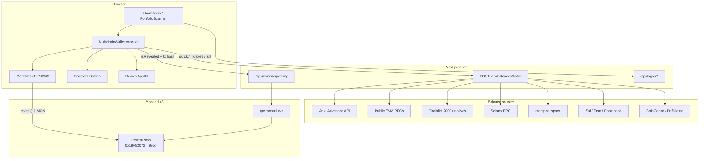
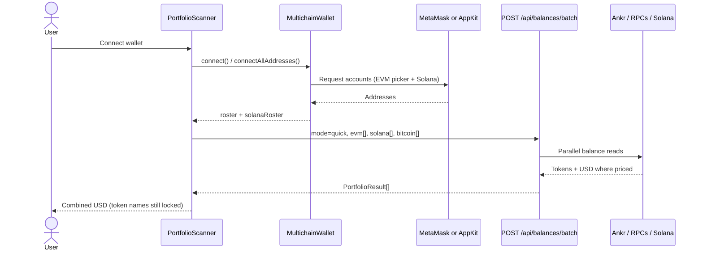
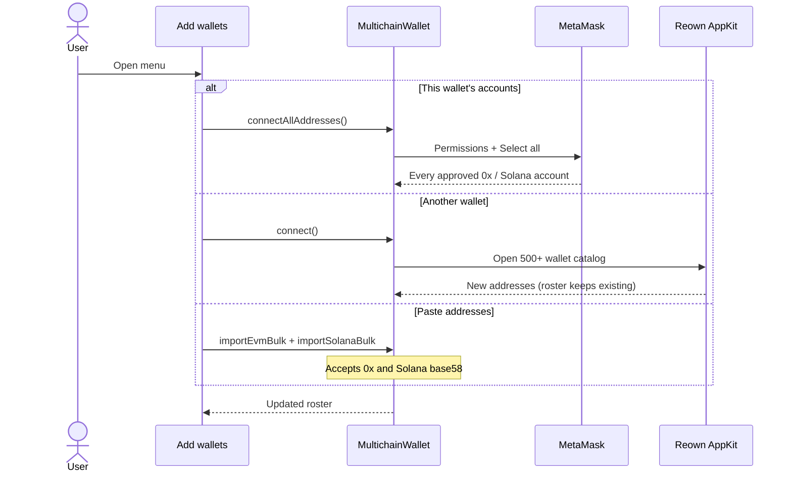
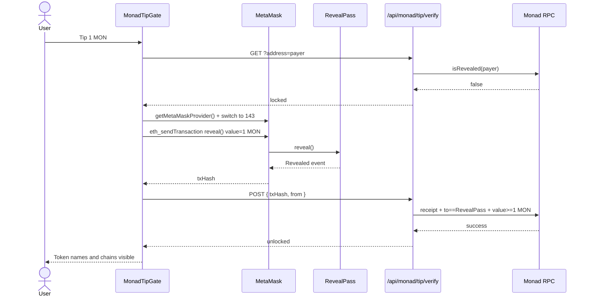
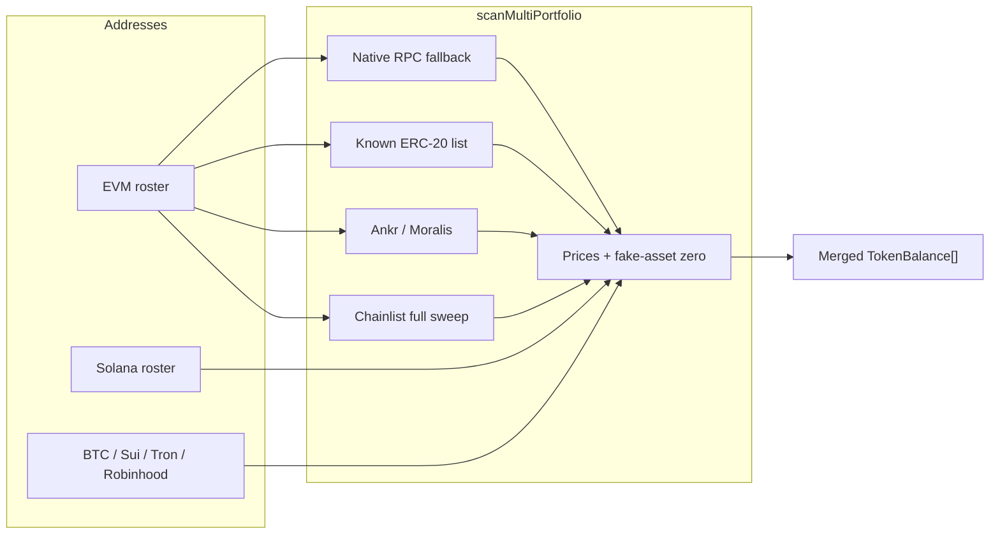

# Find Hidden Money

Forgotten tokens. Every chain your wallet touches. Unlock the inventory with **1 MON** on Monad.

| | |
| --- | --- |
| Product | Find Hidden Money |
| Live | [find-hidden-money.fun](https://www.find-hidden-money.fun/) |
| Pitch deck | [Google Slides](https://docs.google.com/presentation/d/1WE8YuD3uMiGvezz_mtdHm6U-1meZ1P-hcsS65NjVbYY/edit?usp=sharing) |
| Demo video | [x.com/amaanbiz/status/2101301008991441350](https://x.com/amaanbiz/status/2101301008991441350?s=20) |
| Repo | [github.com/AmaanSayyad/find_hidden_money](https://github.com/AmaanSayyad/find_hidden_money) |
| Mainnet contract | RevealPass [`0x19F82072e6612156eC5F8b43fa404c3e3Eef9957`](https://monadscan.com/address/0x19F82072e6612156eC5F8b43fa404c3e3Eef9957) on Monad (`143`) |
| Testnet contract | RevealPass [`0x0FF14768c7598e6F287bfC6451B888c406dfD5Bd`](https://testnet.monadscan.com/address/0x0FF14768c7598e6F287bfC6451B888c406dfD5Bd) on Monad Testnet (`10143`) |
| Tweet | [x.com/amaanbiz/status/2101283730832933220](https://x.com/amaanbiz/status/2101283730832933220?s=20) · tags [@monad](https://x.com/monad) [@monad_dev](https://x.com/monad_dev) [@geeky_kartikey](https://x.com/geeky_kartikey) |
| Tip | **1 MON** via `RevealPass.reveal()` from MetaMask (mainnet live) |
| Host | Vercel · custom domain `www.find-hidden-money.fun` |

### Pitch (say out loud)

1. **Repo** — https://github.com/AmaanSayyad/find_hidden_money
2. **Mainnet contract** — `0x19F82072e6612156eC5F8b43fa404c3e3Eef9957`
3. **Testnet contract** — `0x0FF14768c7598e6F287bfC6451B888c406dfD5Bd`
4. **Live URL** — https://www.find-hidden-money.fun/
5. **Pitch deck** — https://docs.google.com/presentation/d/1WE8YuD3uMiGvezz_mtdHm6U-1meZ1P-hcsS65NjVbYY/edit?usp=sharing
6. **Demo video** — https://x.com/amaanbiz/status/2101301008991441350?s=20
7. **Tweet** — https://x.com/amaanbiz/status/2101283730832933220?s=20
8. **Deployment** — Vercel production on Monad Mainnet (chain ID `143`)

Connect MetaMask or Phantom, see combined USD value immediately, then tip **1 MON** to RevealPass to unlock token names and chains.

---

## The problem

People hold value they cannot see.

- One MetaMask or Phantom account spans dozens of L2s and sidechains
- Dust, airdrops, bridged stables, and unused L2 gas sit forgotten
- Explorers are per-chain; wallets hide zero and dust by default
- There is no single “show me everything I own” moment, and no reason to pay for that reveal in a native L1 token

Result: capital is stranded in plain sight.

## The insight

Portfolio total is curiosity. Token and chain inventory is the product.

Users will pay a small native fee to learn **where** the money is — not just that it exists.

## How it works

1. Connect MetaMask or Phantom (multichain discovery, no paste required)
2. Instantly see combined portfolio value in USD
3. Tip **1 MON** on Monad to unlock which tokens you hold and which networks they live on
4. Filter, search, and deep-scan wallets — then act elsewhere

```
Connect → Scan → Value visible → Tip 1 MON → Tokens + chains unlock
```

### Scan engines

| Source | What it covers |
| --- | --- |
| Ankr / Moralis | Major EVM ERC-20s and prices |
| Chainlist RPC sweep | Native balances on 2,000+ EVM nets |
| Solana / Bitcoin / Sui / Tron / Robinhood / Fraxtal | Non-EVM and extra EVM holdings |
| Monad RPC | Native MON (always scanned) |

### Tip

| Field | Value |
| --- | --- |
| Amount | 1 MON (native) |
| Live chain | Monad Mainnet (`143`) |
| Mainnet contract | RevealPass [`0x19F82072e6612156eC5F8b43fa404c3e3Eef9957`](https://monadscan.com/address/0x19F82072e6612156eC5F8b43fa404c3e3Eef9957) |
| Testnet contract | RevealPass [`0x0FF14768c7598e6F287bfC6451B888c406dfD5Bd`](https://testnet.monadscan.com/address/0x0FF14768c7598e6F287bfC6451B888c406dfD5Bd) on Monad Testnet (`10143`) |
| Call | `RevealPass.reveal()` with 1 MON from MetaMask |
| Verify | Transaction receipt plus on-chain `isRevealed(address)` |
| Deploy tx | [`0x34a32cea…9703`](https://monadscan.com/tx/0x34a32cea2e0f23f3f0c7c1c803f3659374413792b5a46a688ad4c318a6e59703) |
| Live `reveal()` | [`0xcb5ac2f9…2293`](https://monadscan.com/tx/0xcb5ac2f99e0ac0d33098406583ff9a3f0e9f2bf587c24b4c309d28cb7afc2293) |

Phantom stays on Solana. The MON tip always uses the MetaMask EIP-6963 provider.

## Why Monad

- Real L1 utility: every reveal is a native MON transfer on **mainnet**
- Ethereum RPC compatible — same `0x` as MetaMask / Phantom EVM
- ~400ms blocks, ~800ms finality — tip UX feels instant
- Source verified on Sourcify / Monadscan

| Resource | URL |
| --- | --- |
| Docs | [docs.monad.xyz](https://docs.monad.xyz) |
| RPC | [rpc.monad.xyz](https://rpc.monad.xyz) |
| Explorer | [monadscan.com](https://monadscan.com) |
| Vision | [monadvision.com](https://monadvision.com) |

## Product principles

**Before tip**

- Combined USD portfolio value
- Per-wallet totals
- Token symbols, contracts, and chain names stay locked

**After tip**

- Full inventory by chain
- Search, dust filter, deep scan
- Session unlock stored locally after a verified tip

**Security**

- Tip is an explicit user-signed spend in MetaMask (not a hidden approval)
- Phantom is used for Solana discovery, never for the MON tip
- Seed phrases and private keys never leave the user’s machine
- The server only verifies tip transaction hashes on Monad RPC

## Coverage

| Ecosystem | Holdings |
| --- | --- |
| EVM | Ethereum, L2s, HyperEVM, Monad mainnet, Sei, Fraxtal, Robinhood, and 2,000+ Chainlist mainnets |
| Monad | Native MON (tip chain, mainnet `143`) |
| Solana | SOL + SPL / Token-2022 (up to 100 accounts, connect or paste) |
| Bitcoin | Native BTC |
| Sui | SUI + coins |
| Tron | TRX + TRC assets when discovered |

Fake / flash stables (for example PHDR “USDT”) are priced at **$0** after merge.

## Stack

| Layer | Choice |
| --- | --- |
| Frontend | Next.js 16 App Router, React 19, TypeScript, Tailwind v4, Framer Motion |
| Wallets | MetaMask (EIP-6963), Phantom Solana, Reown AppKit (500+ wallets) |
| Indexers | Ankr Advanced API, optional Moralis, public RPCs, Chainlist |
| Monad | `rpc.monad.xyz` · RevealPass · chain `143` |
| Deploy | GitHub → Vercel · [find-hidden-money.fun](https://www.find-hidden-money.fun/) |
| Pitch deck | [Google Slides](https://docs.google.com/presentation/d/1WE8YuD3uMiGvezz_mtdHm6U-1meZ1P-hcsS65NjVbYY/edit?usp=sharing) |
| Demo video | [X](https://x.com/amaanbiz/status/2101301008991441350?s=20) |

---

## Architecture

Next.js App Router UI on Vercel. The browser holds wallet sessions and the roster. Server routes only read public balances and verify Monad tips — they never see a seed or private key.



### App layers

| Layer | Path | Role |
| --- | --- | --- |
| Pages | `src/app/page.tsx` | Landing + scanner shell |
| UI | `src/components/` | Connect, scan tape, wallet hub, tip gate |
| Wallet session | `src/context/MultichainWallet.tsx` | Roster, Solana roster, connect-all, paste |
| Scan | `src/lib/balances/` | Merge Ankr, natives, ERC-20s, non-EVM |
| Monad tip | `src/lib/monad/` | RevealPass ABI, verify, MetaMask-only send |
| Contract | `contracts/src/RevealPass.sol` | `reveal()` records unlock, takes 1 MON |

Scan modes (`src/lib/balances/index.ts`):

- **quick** — major natives + well-known ERC-20s (first pass over a large roster)
- **indexed** — natives, known ERC-20s, extra mainnets, Ankr/Moralis tokens
- **full** — indexed plus 2,000+ Chainlist mainnet natives (no testnets)

---

## Sequence diagrams

### Connect, roster, and scan



### Add wallets (one control)



### MON tip unlock (MetaMask only)

Phantom can stay on Solana. The tip always uses the MetaMask EIP-6963 provider — never `window.phantom.ethereum`.



### Scan merge (server)



---

### Pre-market fit, revenue, innovation

Judge-facing notes for the live demo (up to 60 points).

### Pre-market fit

Wallet users already hold value they cannot see: dust on old L2s, leftover gas, SPL tokens, bridged stables. Explorers are per-chain. Find Hidden Money is the first screen that answers “what is this wallet worth?” for free, then charges a native MON fee only when the user wants the map. That is a real habit (checking a portfolio) with a real payment (one on-chain tip). The live app at [find-hidden-money.fun](https://www.find-hidden-money.fun/) already connects MetaMask / Phantom, scans 2,000+ EVM nets plus Solana / BTC / Sui / Tron, and unlocks names after `reveal()`.

### Revenue potential and strategy

- **Primary:** 1 MON per reveal on Monad Mainnet. Paid in the open, no subscription, no custody.
- **Unit:** one wallet session → one `RevealPass.reveal()` → 1 native MON stays on the contract. Cost to serve is indexer RPC + a receipt check.
- **Expansion:** roster unlocks (pay once for many addresses), partner deep-scan, optional API for wallets that want a “forgotten funds” badge.
- **Why MON:** the fee is not a stablecoin checkout. Every curious portfolio check creates Monad L1 demand.

### Innovation and originality

- Totals are free; **token names and chains stay locked** until a mainnet MON tip. That is a product, not a faucet demo.
- Tips always go through **MetaMask EIP-6963**, even when Phantom is connected for Solana — so the MON path cannot be hijacked.
- Coverage is the product: Ankr / Moralis indexed tokens plus a Chainlist sweep of 2,000+ mainnets, with flash / impersonator stables forced to **$0**.
- RevealPass is a verified mainnet contract: pay 1 MON, record `isRevealed`, keep the tip on the contract. Source: `contracts/src/RevealPass.sol`.

### Socials (Blitz)

| Criteria | Proof |
| --- | --- |
| Pitch deck | [Google Slides](https://docs.google.com/presentation/d/1WE8YuD3uMiGvezz_mtdHm6U-1meZ1P-hcsS65NjVbYY/edit?usp=sharing) |
| Posted on X / LinkedIn tagging `@monad`, `@monad_dev`, `@geeky_kartikey` | [X post](https://x.com/amaanbiz/status/2101283730832933220?s=20) |
| Demo video on socials (30s+, product running) | [Demo Video](https://x.com/amaanbiz/status/2101301008991441350?s=20) |
| Creative product ad on socials | [Launch post](https://x.com/amaanbiz/status/2101283730832933220?s=20) + [demo video](https://x.com/amaanbiz/status/2101301008991441350?s=20) |
| 5K+ collective views during Blitz | In progress — keep quoting, clipping, and sharing LinkedIn + X |

---

# Developer setup

```bash
npm install
cp .env.example .env.local
# set ANKR_API_KEY (recommended)
npm run dev
```

| Variable | Purpose |
| --- | --- |
| `ANKR_API_KEY` | ERC-20 + priced balances on Ankr indexed chains |
| `MORALIS_API_KEY` | Optional indexer fallback |
| `SOLANA_RPC_URL` | Optional dedicated Solana RPC |
| `TRONGRID_API_KEY` | Optional Tron rate limits |
| `MONAD_RPC_URL` | Optional Monad Mainnet RPC override |
| `NEXT_PUBLIC_REOWN_PROJECT_ID` | Reown AppKit (500+ wallets). Injected wallets work without it. |
| `MONAD_TEST_PK` | Local RevealPass smoke tests only — **never commit** |

Tip defaults live in `src/lib/monad/config.ts` (production uses **mainnet**):

- Amount: **1 MON**
- Mainnet RevealPass: [`0x19F82072e6612156eC5F8b43fa404c3e3Eef9957`](https://monadscan.com/address/0x19F82072e6612156eC5F8b43fa404c3e3Eef9957) (`143`)
- Testnet RevealPass: [`0x0FF14768c7598e6F287bfC6451B888c406dfD5Bd`](https://testnet.monadscan.com/address/0x0FF14768c7598e6F287bfC6451B888c406dfD5Bd) (`10143`)
- Pitch deck: [Google Slides](https://docs.google.com/presentation/d/1WE8YuD3uMiGvezz_mtdHm6U-1meZ1P-hcsS65NjVbYY/edit?usp=sharing)
- Demo video: [X](https://x.com/amaanbiz/status/2101301008991441350?s=20)
- Source: `contracts/src/RevealPass.sol`

```bash
npm run test-monad-tip   # optional: MONAD_TEST_PK=0x… (never commit keys)
```

Add Monad in MetaMask:

| Setting | Mainnet | Testnet |
| --- | --- | --- |
| Network name | Monad | Monad Testnet |
| RPC URL | `https://rpc.monad.xyz` | `https://testnet-rpc.monad.xyz` |
| Chain ID | `143` | `10143` |
| Currency | `MON` | `MON` |
| Explorer | [monadscan.com](https://monadscan.com) | [testnet.monadscan.com](https://testnet.monadscan.com) |
| RevealPass | [`0x19F82072…9957`](https://monadscan.com/address/0x19F82072e6612156eC5F8b43fa404c3e3Eef9957) | [`0x0FF14768…D5Bd`](https://testnet.monadscan.com/address/0x0FF14768c7598e6F287bfC6451B888c406dfD5Bd) |

## License

Source available. Public repo for this product.
