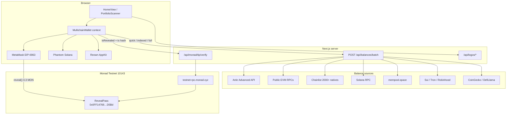
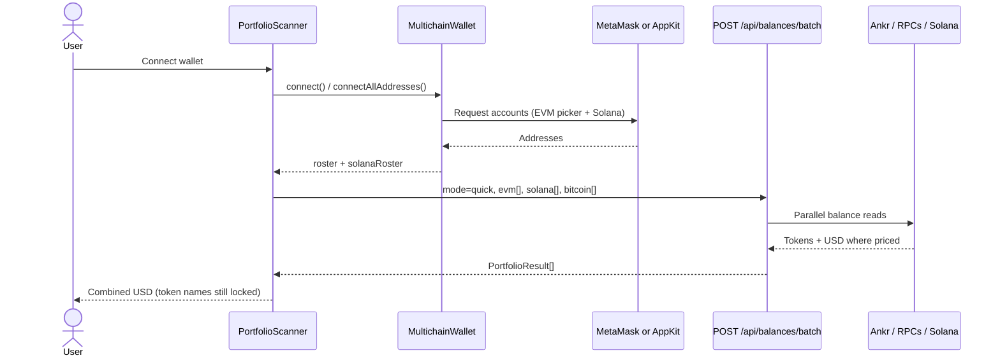
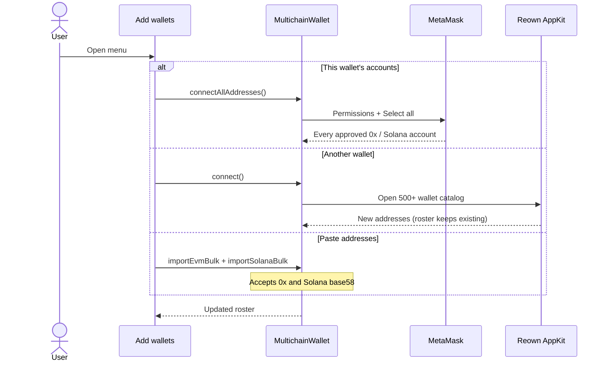
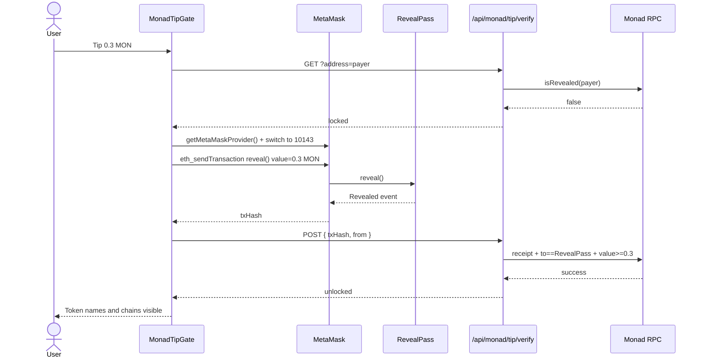
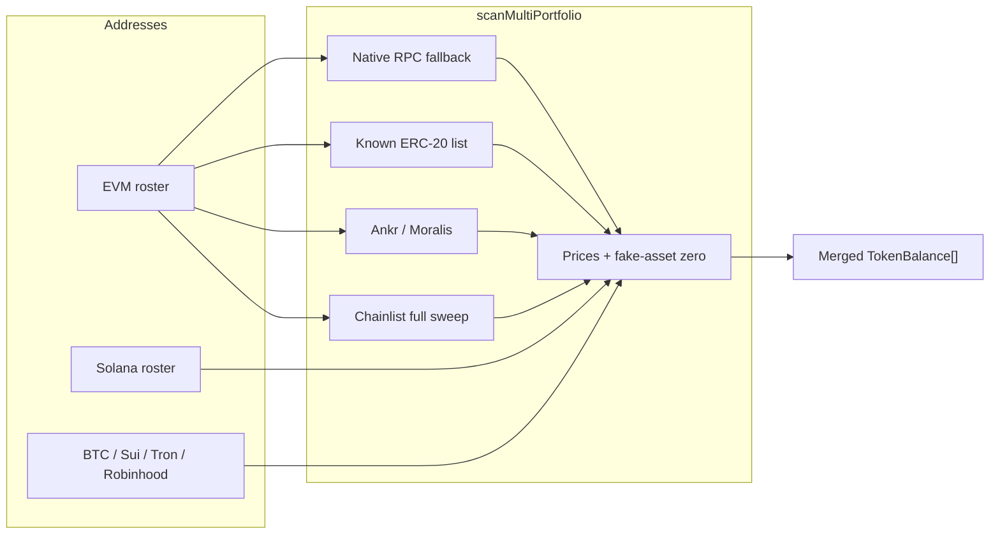

# Find Hidden Money

Forgotten tokens. Every chain your wallet touches. Unlock the inventory with **0.3 MON** on Monad Testnet.

| | |
| --- | --- |
| Product | Find Hidden Money |
| Networks | Monad Testnet (`10143`) plus EVM, Solana, Bitcoin, Sui, and Tron |
| Repo | [github.com/AmaanSayyad/find_hidden_money](https://github.com/AmaanSayyad/find_hidden_money) |

Connect MetaMask or Phantom, see combined USD value immediately, then tip **0.3 MON** to RevealPass to unlock token names and chains.

---

## The problem

People hold value they cannot see.

- One MetaMask or Phantom account spans dozens of L2s and sidechains
- Dust, airdrops, bridged stables, and unused L2 gas sit forgotten
- Explorers are per-chain; wallets hide zero and dust by default
- There is no single “show me everything I own” moment, and no reason to pay for that reveal in a native L1 token

Result: capital is stranded in plain sight.

## The insight

Portfolio total is curiosity. Token and chain inventory is the product.

Users will pay a small native fee to learn **where** the money is — not just that it exists.

## How it works

1. Connect MetaMask or Phantom (multichain discovery, no paste required)
2. Instantly see combined portfolio value in USD
3. Tip **0.3 MON** on Monad Testnet to unlock which tokens you hold and which networks they live on
4. Filter, search, and deep-scan wallets — then act elsewhere

```
Connect → Scan → Value visible → Tip 0.3 MON → Tokens + chains unlock
```

### Scan engines

| Source | What it covers |
| --- | --- |
| Ankr / Moralis | Major EVM ERC-20s and prices |
| Chainlist RPC sweep | Native balances on 2,000+ EVM nets |
| Solana / Bitcoin / Sui / Tron / Robinhood / Fraxtal | Non-EVM and extra EVM holdings |
| Monad Testnet RPC | Native MON (always scanned) |

### Tip

| Field | Value |
| --- | --- |
| Amount | 0.3 MON (native) |
| Chain | Monad Testnet (`10143`) |
| Contract | RevealPass [`0x0FF14768c7598e6F287bfC6451B888c406dfD5Bd`](https://testnet.monadexplorer.com/address/0x0FF14768c7598e6F287bfC6451B888c406dfD5Bd) |
| Call | `RevealPass.reveal()` with 0.3 MON from MetaMask |
| Verify | Transaction receipt plus on-chain `isRevealed(address)` |

Phantom stays on Solana. The MON tip always uses the MetaMask EIP-6963 provider.

## Why Monad Testnet

- Real L1 utility: every reveal is a native MON transfer
- Ethereum RPC compatible — same `0x` as MetaMask / Phantom EVM
- ~400ms blocks, ~800ms finality — tip UX feels instant
- Official testnet RPC, explorer, and faucet

| Resource | URL |
| --- | --- |
| Docs | [docs.monad.xyz](https://docs.monad.xyz) |
| RPC | [testnet-rpc.monad.xyz](https://testnet-rpc.monad.xyz) |
| Explorer | [testnet.monadexplorer.com](https://testnet.monadexplorer.com) |
| Faucet | [faucet.monad.xyz](https://faucet.monad.xyz) |

## Product principles

**Before tip**

- Combined USD portfolio value
- Per-wallet totals
- Token symbols, contracts, and chain names stay locked

**After tip**

- Full inventory by chain
- Search, dust filter, deep scan
- Session unlock stored locally after a verified tip

**Security**

- Tip is an explicit user-signed spend in MetaMask (not a hidden approval)
- Phantom is used for Solana discovery, never for the MON tip
- Seed phrases and private keys never leave the user’s machine
- The server only verifies tip transaction hashes on Monad Testnet RPC

## Coverage

| Ecosystem | Holdings |
| --- | --- |
| EVM | Ethereum, L2s, HyperEVM, Monad mainnet, Sei, Fraxtal, Robinhood, and 2,000+ Chainlist mainnets |
| Monad Testnet | Native MON (tip chain) |
| Solana | SOL + SPL / Token-2022 (up to 100 accounts, connect or paste) |
| Bitcoin | Native BTC |
| Sui | SUI + coins |
| Tron | TRX + TRC assets when discovered |

Fake / flash stables (for example PHDR “USDT”) are priced at **$0** after merge.

## Stack

| Layer | Choice |
| --- | --- |
| Frontend | Next.js 16 App Router, React 19, TypeScript, Tailwind v4, Framer Motion |
| Wallets | MetaMask (EIP-6963), Phantom Solana, Reown AppKit (500+ wallets) |
| Indexers | Ankr Advanced API, optional Moralis, public RPCs, Chainlist |
| Monad Testnet | `testnet-rpc.monad.xyz` · RevealPass · chain `10143` |
| Deploy | GitHub → Vercel (`ANKR_API_KEY` as server env) |

---

## Architecture

Next.js App Router UI on Vercel. The browser holds wallet sessions and the roster. Server routes only read public balances and verify Monad tips — they never see a seed or private key.



### App layers

| Layer | Path | Role |
| --- | --- | --- |
| Pages | `src/app/page.tsx` | Landing + scanner shell |
| UI | `src/components/` | Connect, scan tape, wallet hub, tip gate |
| Wallet session | `src/context/MultichainWallet.tsx` | Roster, Solana roster, connect-all, paste |
| Scan | `src/lib/balances/` | Merge Ankr, natives, ERC-20s, non-EVM |
| Monad tip | `src/lib/monad/` | RevealPass ABI, verify, MetaMask-only send |
| Contract | `contracts/src/RevealPass.sol` | `reveal()` records unlock, takes 0.3 MON |

Scan modes (`src/lib/balances/index.ts`):

- **quick** — major natives + well-known ERC-20s (first pass over a large roster)
- **indexed** — natives, known ERC-20s, extra mainnets, Ankr/Moralis tokens
- **full** — indexed plus 2,000+ Chainlist mainnet natives (no testnets)

---

## Sequence diagrams

### Connect, roster, and scan



### Add wallets (one control)



### MON tip unlock (MetaMask only)

Phantom can stay on Solana. The tip always uses the MetaMask EIP-6963 provider — never `window.phantom.ethereum`.



### Scan merge (server)



---

## Developer setup

```bash
npm install
cp .env.example .env.local
# set ANKR_API_KEY (recommended)
npm run dev
```

| Variable | Purpose |
| --- | --- |
| `ANKR_API_KEY` | ERC-20 + priced balances on Ankr indexed chains |
| `MORALIS_API_KEY` | Optional indexer fallback |
| `SOLANA_RPC_URL` | Optional dedicated Solana RPC |
| `TRONGRID_API_KEY` | Optional Tron rate limits |
| `MONAD_RPC_URL` | Optional Monad Testnet RPC override |
| `NEXT_PUBLIC_REOWN_PROJECT_ID` | Reown AppKit (500+ wallets). Injected wallets work without it. |
| `MONAD_TEST_PK` | Local RevealPass smoke tests only — **never commit** |

Tip defaults live in `src/lib/monad/config.ts`:

- Amount: **0.3 MON**
- Contract: [`0x0FF14768c7598e6F287bfC6451B888c406dfD5Bd`](https://testnet.monadexplorer.com/address/0x0FF14768c7598e6F287bfC6451B888c406dfD5Bd)
- Source: `contracts/src/RevealPass.sol`

```bash
npm run test-monad-tip   # optional: MONAD_TEST_PK=0x… (never commit keys)
```

Add Monad Testnet in MetaMask:

| Setting | Value |
| --- | --- |
| Network name | Monad Testnet |
| RPC URL | `https://testnet-rpc.monad.xyz` |
| Chain ID | `10143` |
| Currency | `MON` |
| Explorer | [testnet.monadexplorer.com](https://testnet.monadexplorer.com) |
| Faucet | [faucet.monad.xyz](https://faucet.monad.xyz) |

## License

Private / product repo — see GitHub permissions.
